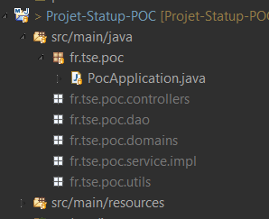
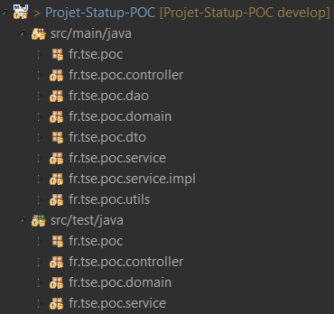

# Projet-Statup-POC

### Documentation API
Swagger : [Documentation](https://app.swaggerhub.com/apis-docs/Projet-Startup-Poc/Projet-Startup-POC/1.0.0#/)

### Architecture

### Packages :

### Domain Objects - Class diagram :

## API Documentation
https://app.swaggerhub.com/apis-docs/Projet-Startup-Poc/Projet-Startup-POC/1.0.0#/

## Minimum Requirements
* **JDK8:**
* **MySQL**

## Installation
- Clone repository : `git clone https://github.com/ValentinMoreau08/Projet-Statup-POC.git`
- Navigate into cloned folder : `cd Projet-Startup-POC`
- Use latest branch : `git checkout develop`
- Import project into your IDE

    
## Configure MySQL access :
We use 2 Databases in this project : A first for production (default: **poc**), A second for tests only (default: **poc-test**).
   
- Configure access to these Databases in files :
  - `src/main/resources/application.properties`
  - `src/main/resources/application-test.properties`
- **Create MySQL databases :**
  - In MySQL, create 2 empty database with name defined previously. (Our application will create tables, but can't create Databases)

## Start
- Make sure your MySQL is started
- Run with maven
